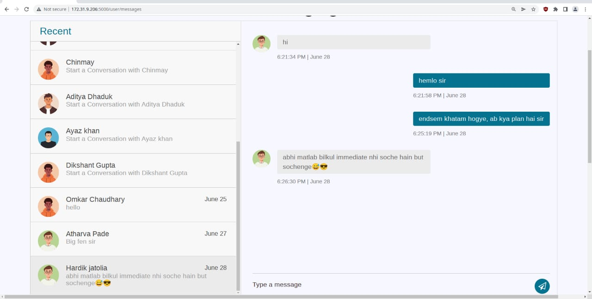

# Privet
Simple Web Chat Application for sending messages

  

# Tech Stack

Backend is Developed in Python using Flask framework. Frontend is developed in HTML, CSS, JS using Bootstrap framework. 'Postgres' is used as database. Flask Blueprint and Services-Model-Repository pattern is used to make code Modular and extendible.

